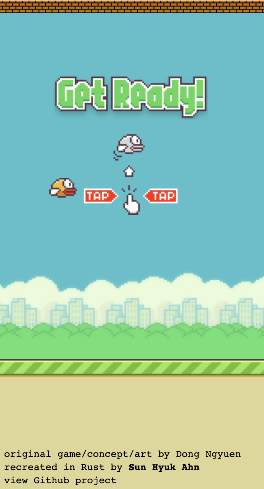

# Rusty Bird

A clone of Flappy Bird, build with Rust framework Seed.

  

Open source game created by Nebez Briefkani.

Original game created by Dong Ngyuen.

## 1. Install / check required tools

1. Make sure you have basic tools installed:

   - [Rust](https://www.rust-lang.org)
     - Check: `$ rustc -V` => `rustc 1.43.1 (8d69840ab 2020-05-04)`
     - Install: https://www.rust-lang.org/tools/install
   - [cargo-make](https://sagiegurari.github.io/cargo-make/)
     - Check: `$ cargo make -V` => `cargo-make 0.30.7`
     - Install: `$ cargo install cargo-make`

1. Platform-specific tools like `ssl` and `pkg-config`:
    - Follow recommendations in build errors (during the next chapter).
    - _Note_: Don't hesitate to write notes or a tutorial for your platform and create a PR .

## 2. Prepare your project for work

1. Open the project in your favorite IDE (I recommend [VS Code](https://code.visualstudio.com/) + [Rust Analyzer](https://rust-analyzer.github.io/)).
1. Open a new terminal tab / window and run: `cargo make serve`
1. Open a second terminal tab and run: `cargo make watch`
1. If you see errors, try to fix them or write on our [chat](https://discord.gg/JHHcHp5) or [forum](https://seed.discourse.group/).
1. Modify files like `README.md` and `Cargo.toml` as you wish.

## Other Seed quickstarts and projects

- [seed-rs/awesome-seed-rs](https://github.com/seed-rs/awesome-seed-rs)

---

**!!! New Rust-only quickstart in development! => [Seeder](https://github.com/MartinKavik/seeder) !!!**

---